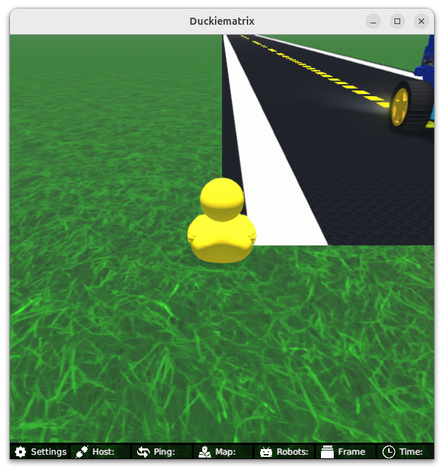
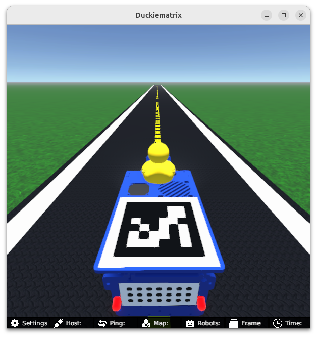

<p align="center">

</p>

# **Learning Experience (LX): Control**

# About these activities


In this learning experience, you will use the model that we built in the 
[kinematics and modeling](https://github.com/duckietown/lx-kinematics-odometry)
learning experience. Now we will build a simple controller to make the Duckiebot
follow a specified set of actions based on our knowledge of how it moves. 

This learning experience is provided by the Duckietown team and can be run on Duckiebots. Visit us at the 
[Duckietown Website](https://www.duckietown.com) for more learning materials, documentation, and demos.

For guided setup instructions, lecture content, and more related to this LX, see [our Self-Driving Cars with Duckietown MOOC on EdX](https://learning.edx.org/course/course-v1:ETHx+DT-01x+3T2022/home).

# Instructions

**NOTE:** All commands below are intended to be executed from the root directory of this exercise (i.e., the directory containing this README).

**(If not already done) Clone this repository**

The recommended way to use this repository is to make a fork and then clone that fork. 

This can be done through the GitHub web interface. However, you are also free to simply clone this repository and get started. 

**NOTE:** Example instructions to fork a repository and configure to pull from upstream can be found in the 
[duckietown-lx repository README](https://github.com/duckietown/duckietown-lx/blob/mooc2022/README.md).

This exercise can be run on a [real Duckiebot](https://get.duckietown.com/products/duckiebot-db21?variant=41543707099311) or on a virtual Duckiebot in [the Duckiematrix](https://docs.duckietown.com/ente/duckietown-manual/50-duckiematrix/introduction-to-the-duckiematrix-virtual-environment.html). 

## 1. Make sure your LX is up-to-date

Update your exercise definition and instructions,

    git remote add upstream git@github.com:duckietown/lx-control
    git pull upstream <your upstream branch>


## 2. Make sure your system is up-to-date

- 💻 This is an `ente` learning experience (note the branch name). Make sure your Duckietown Shell is set to an `ente` profile (and not, e.g., a `daffy` one). You can check your current distribution with

    dts profile list

  To switch to an ente profile, follow the [Duckietown Manual DTS installation instructions](https://docs.duckietown.com/ente/duckietown-manual/10-setup/02-software/duckietown-shell-dts-installation.html#dt-account-switch-profile).


- 💻 Always make sure your Duckietown Shell is updated to the latest version. See [installation instructions](https://github.com/duckietown/duckietown-shell)

- 💻 Update the shell commands: `dts update`

- 💻 Update your laptop/desktop: `dts desktop update`

- 🚙 Update your Duckiebot: `dts duckiebot update ROBOTNAME` (where `ROBOTNAME` is the name of your Duckiebot chosen during the initialization procedure.)
(where `ROBOTNAME` is the name of your Duckiebot - real or virtual.)

**Note**: if your virtual robot hangs indefinitely when you try to update it, you can try to restart it with:


## 3. Work on the exercise

### Launch the code editor

#### SSL certificate

If you have not done so already, set up your local SSL certificate needed to run the learning experience editor with:

    sudo apt install libnss3-tools
    dts setup mkcert


Open the code editor by running the following command,

```
dts code editor
```

Wait for a URL to appear on the terminal, then click on it or copy-paste it in the address bar
of your browser to access the code editor. The first thing you will see in the code editor is
this same document, you can continue there.

**NOTE**: if you are running Duckietown inside a devcontainer, make sure to [install the certificate for your host machine as well](https://docs.duckietown.com/ente/duckietown-manual/10-setup/setup-devcontainer.html#dts-code-run). 


### Walkthrough of notebooks

**NOTE**: You should be reading this from inside the code editor in your browser.

Inside the code editor, use the navigator sidebar on the left-hand side to navigate to the
`notebooks` directory and open the first notebook.

Follow the instructions on the notebook and work through the notebooks in sequence.


### Testing with the Duckiematrix

To test your code in the Duckiematrix you will need a virtual robot. You can create one with the command:

```
dts duckiebot virtual create --type duckiebot --configuration DB21J [VBOT]
```

where `[VBOT]` is the hostname. It can be anything you like, with [some constraints](https://docs.duckietown.com/ente/duckietown-manual/10-setup/03-duckiebot/flashing-sd-card-duckiebot-initialization-complete.html). Make sure to remember your robot (host)name for later.

Then you can start your virtual robot with the command:

```
dts duckiebot virtual start [VBOT]
```

You should see it with a status `Booting` and finally `Ready` if you look at `dts fleet discover`: 

```
     | Hardware |   Type    | Model |  Status  | Hostname 
---  | -------- | --------- | ----- | -------- | ---------
[VBOT] |  virtual | duckiebot | DB21J |  Ready   | [VBOT].local
```

Now that your virtual robot is ready, you can start the Duckiematrix. From this exercise directory do:

```
dts code start_matrix
```
You should see the Unity-based Duckiematrix simulator start up. The startup screen will look like:



Your Duckiebot is at the start of a long straightaway.

From here you can click anywhere on the window and click [ENTER] to make it become active. From here you can move the duckie towards the Duckiebot with the 'w', 'a', 's', and 'd' keys or you can move the camera angle to view the Duckiebot with the mouse. You can also mount your car with the 'E' key, which should look like



If you get very lost from the road and you want to come back, you can do so with the 'R' key. 


### Building your code

You can build your code with 

```
dts code build -R ROBOT_NAME
```

This will build a docker image with your code compiled inside - you should your ROS node get built during the process. 


### 💻 Testing 


To test your code in the duckiematrix you can do:

```
dts code workbench -m -R [VIRTUAL_ROBOT_NAME]
```

and to test your code on your real Duckiebot you can do:

```
dts code workbench -R [ROBOT_NAME]
```


In another terminal, you can launch the `noVNC` viewer for this exercise which can be useful to send commands to the robot and view the odometry that you calculating in the RViZ window. 

```
dts code vnc -R [ROBOT_NAME]
```

where `[ROBOT_NAME]` could be the real or the virtual robot (use whichever you ran the `dts code workbench` and `dts code build` command with).


Now you can proceed to the [first notebook](./notebooks/PID_heading_controller.ipynb).
